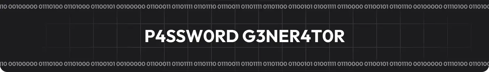
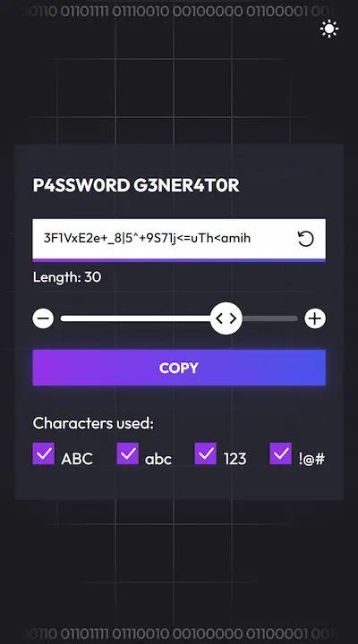
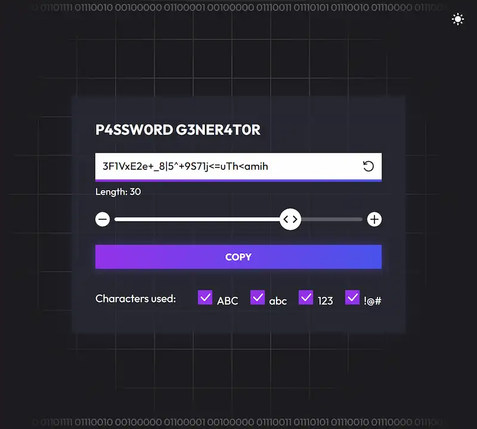
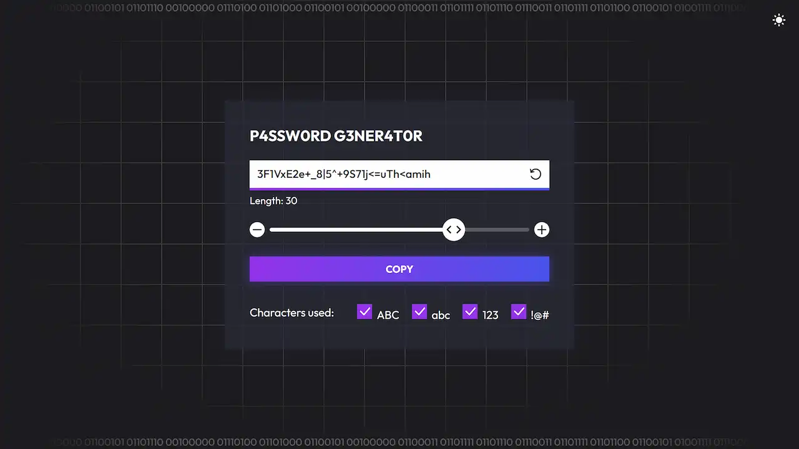
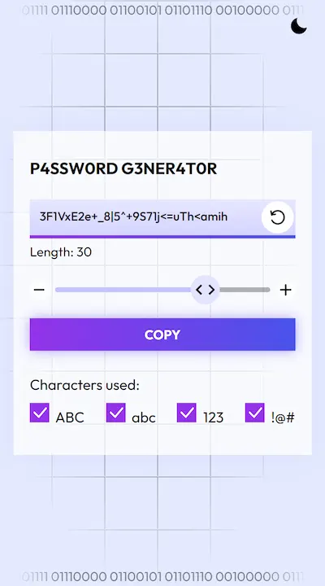
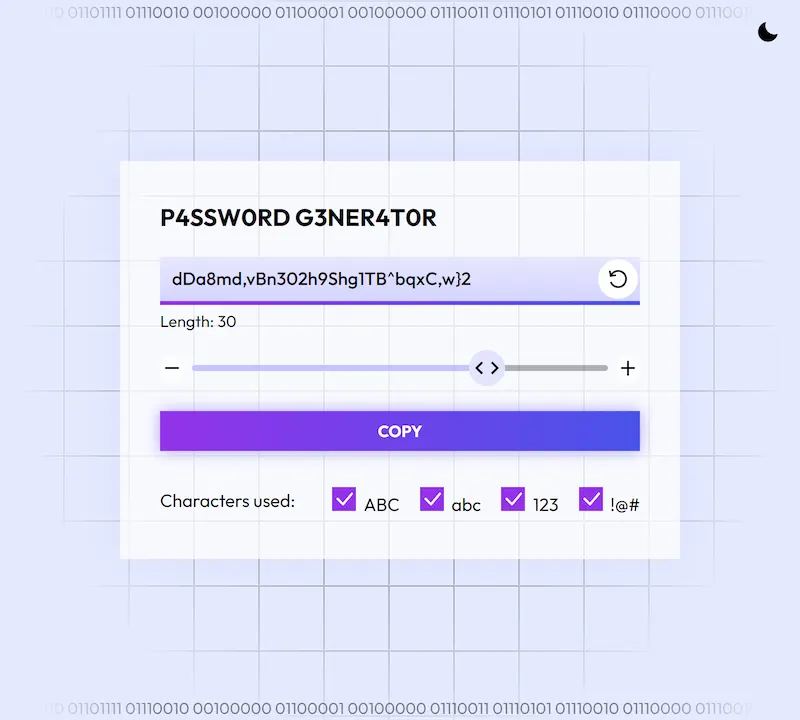
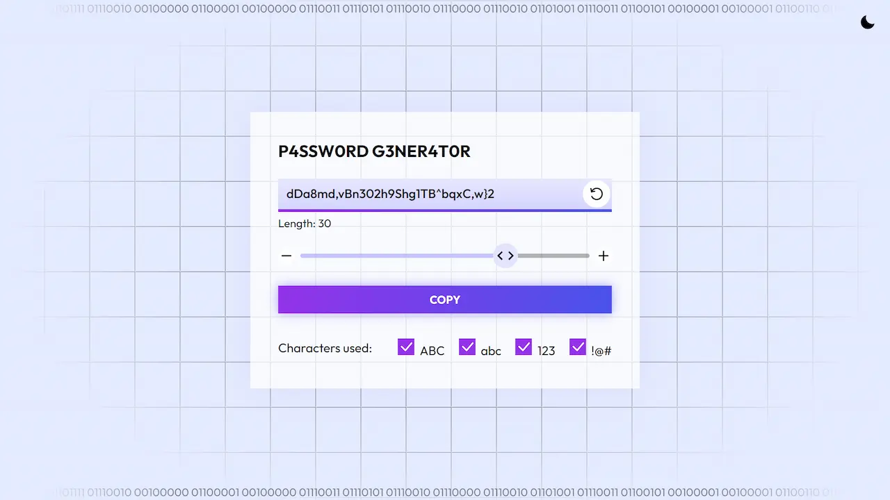

<div id="top"></div>

<div align="center">
	<a href="https://passwordss.vercel.app">
		
	</a>

  # 🔐 Passwordss 🔑

  Strong Password Generator – Create strong, random combinations to protect your online accounts. Keep your data safe with just one click!.

  <a href="https://passwordss.vercel.app">View Demo</a>
  ·
  <a href="https://github.com/spatz-pearl/password-generator/issues">Report Bug</a>
  ·
  <a href="https://github.com/spatz-pearl/password-generator/issues">Request Feature</a>

</div>


<!-- TABLE OF CONTENTS -->
<details>
<summary>Table of contents</summary>

- [About The Project](#about-the-project)
- [Screenshots](#screenshots)
- [Built With](#built-with)
- [Getting Started](#getting-started)
- [License](#license)
- [Contact](#contact)

</details>


<!-- ABOUT THE PROJECT -->
## About The Project

Generate strong passwords with Passwordss. The passwords are generated locally in your browser and are never sent to the server. Passwordss is a simple, secure, and free password generator. You can use it to create strong passwords for your online accounts and protect your data from hackers.

<p align="right"><a href="#top">⬆ Back to top</a></p>


<!-- SCREENSHOTS -->
## Screenshots

<table>
    <tr>
      <td>
          
      </td>
      <td>
          
      </td>
      <td>
          
      </td>
    </tr>
    <tr>
      <td>
          
      </td>
      <td>
          
      </td>
      <td>
          
      </td>
    </tr>
</table>

<p align="right"><a href="#top">⬆ Back to top</a></p>


### Built With

* [Vercel](https://vercel.com/) For hosting
* [Tailwind CSS](https://tailwindcss.com/) For styling
* [Figma](https://www.figma.com/) For the design
* [Svelte](https://svelte.dev/) For the frontend

<p align="right"><a href="#top">⬆ Back to top</a></p>


<!-- GETTING STARTED -->
## Getting Started

1. Clone or fork the repo
```sh
git clone https://github.com/spatz-pearl/password-generator
```
2. Go to the project folder
```sh
cd password-generator
```
3. Install NPM packages
```sh
npm install
```
4. Run the project
```sh
npm run dev
```

<p align="right"><a href="#top">⬆ Back to top</a></p>


<!-- LICENSE -->
## License

Distributed under the **MIT License**. See [`LICENSE`](https://github.com/spatz-pearl/password-generator/blob/main/LICENCE) for more information.


<p align="right"><a href="#top">⬆ Back to top</a></p>
